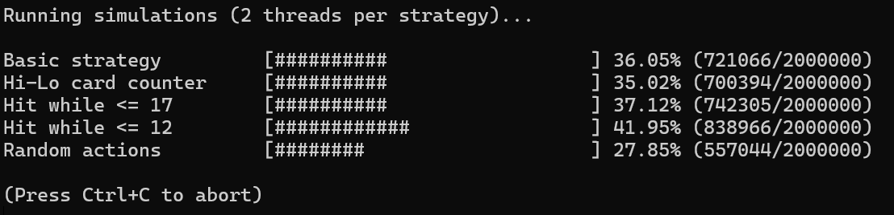
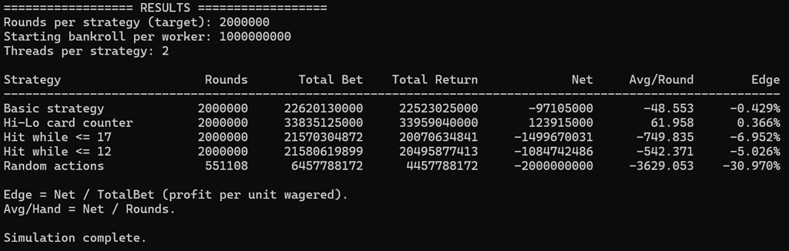

# Blackjack Simulator 

Console-based **blackjack simulation engine** built to run large-scale experiments and compare playing/betting strategies.

Designed with maintainability and extensibility in mind (SOLID, Strategy pattern, Observer-style event hooks), and supports multithreaded simulations to evaluate multiple strategies concurrently.

---

## Highlits

- **Modular architecture (SOLID / OOD):**
  - Strategy pattern via `IActionPolicy` + `IBettingPolicy`
  - Observer-style hooks via `CounterEvents` (e.g., Hi-Lo counting reacts to cards + reshuffles)
- **Multithreaded simulation runner**
  - Runs each strategy in parallel, optionally with multiple workers per strategy
  - Aggregates results across workers deterministically (no shared shoe / session state)
- **Supports core Blackjack mechanics**
  - Insurance, doubling, splitting (incl. split aces restriction), dealer play (soft 17 logic)
- **Fast Monte Carlo experiments**
  - Progress UI and summary output: rounds, total bet, total return, net, avg/round, edge

---

## Screenshots

- Progress UI:
  
- Example results table:
  

---

## Strategies implemented

Each "strategy" is composed of:
- **Action policy** (`IActionPolicy`) → hit/stand/double/split/insurance decisions
- **Betting policy** (`IBettingPolicy`) → bet sizing given bankroll and game state

Current strategies:

1. **Basic strategy**
   - Plays a simplified basic strategy for hard/soft hands and splits.
   - Bets a constant base fraction of the initial bankroll.

2. **Hi-Lo card counter**
   - Tracks running/true count using Hi-Lo values through `CounterEvents`.
   - Uses basic strategy for most actions, but:
     - Takes insurance only when true count is high (configurable threshold).
     - Scales bet size based on true count (e.g., 1x / 2x / 4x / 8x base).

3. **Hit while ≤ 17**
   - Mimics a common “intuitive” player: keeps hitting until hand value exceeds 17.
   - Adds small random bet variation around a base bet.

4. **Hit while ≤ 12**
   - Even more conservative: hits until exceeding 12.
   - Adds small random bet variation around a base bet.

5. **Random actions**
   - Random hit/stand, with probabilistic doubling.
   - Randomized bet sizing around a base bet.

---

## Running the simulation

Simulation parameters are configurable in `main.cpp`:

```cpp
config.startingBalance = 1'000'000'000;
config.roundsPerStrategy = 2'000'000;
config.threadsPerStrategy = 2;
```

Building (Visual Studio)
1. Open `Simulator/Simulator.sln`
2. Select **Release** configuration
3. Build and run the project

The entry point is in `main.cpp`

---

## Extending the project

To add a new strategy:
1. Implement `IActionPolicy`
2. Implement `IBettingPolicy`
3. Register the strategy in the simulation runner

No changes to the game engine are required.
